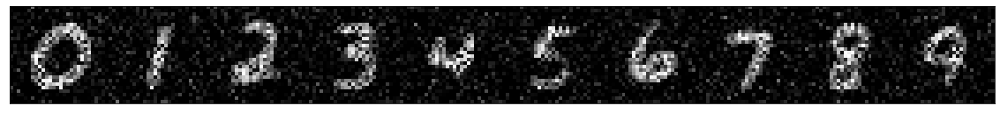

# generative-models

An implementation of the Maximum Entropy Generative model based as discussed in the paper [*A high-bias, low-variance introduction to Machine Learning for physicists*](https://doi.org/10.1016/j.physrep.2019.03.001) ([or here on arXiv](https://arxiv.org/abs/1803.08823)) can be found in `gempy.maximum_entropy_model.py`, slides are located in `doc`.

In `gempy.mnist.mnist_generator.py` we apply the Maximum Entropy Principle to generate (or fit) an Ising-based generative model on single numbers in the mnist-dataset. `gempy.mnist.mnist_generator.ipynb` provides a classifier cnn as well as `MNISTGenerator` instances which can be trained to generate numbers from `0` to `9` using the Maximum Entropy Principle, which can then be evaluated with the classifyer network.  
Here are example figures, from 0 to 9, generated by the Maximum Entropy model trained on the mnist-dataset within the jupyter-notebook:

